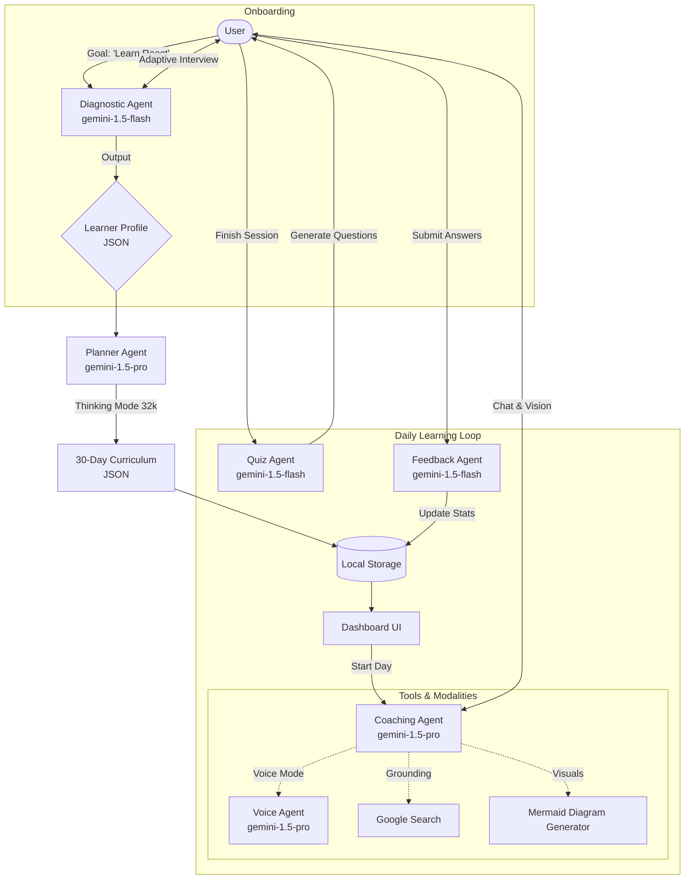

<p align="center">
  
</p>

# Personalized Learning Mentor: MentorAI 🎓

> **A multi-agent AI system that builds bespoke 30-day curricula, adapts to your learning style, and ensures mastery through real-time multimodal coaching.**

<p align="center">
  
  
  
</p>

---

## 1. The Problem 🚨

Self-directed learning is often overwhelming and inefficient due to:

- Too much content with no clear path (“analysis paralysis”).  
- Lack of personalized guidance and feedback.  
- Static curricula that fail to adapt to prior knowledge and learning style. 

## 2. The Solution 💡

MentorAI is a **multi-agent AI system** that acts as a personalized tutor. It:

- Builds a **30-day adaptive curriculum** for each learner.  
- Maintains **long-term memory** of skills, goals, and learning style.  
- Interacts via **text, voice, and visuals**, providing guidance, quizzes, and feedback. 

MentorAI empowers learners by providing structured, adaptive learning plans that improve engagement and skill mastery without the need for human tutors.

---

## 3. Core Features & Value

*   **🤖 Multi-Agent System:** Orchestrates five specialized AI agents, each powered by a specific Gemini model, to create a seamless learning journey.
*   **🧠 Adaptive Curriculum:** Generates a personalized 30-day learning plan based on an initial diagnostic interview, not just self-reported skill levels.
*   **💬 Multimodal Coaching:** Interacts via text, voice, and vision. Users can upload screenshots of code, ask questions verbally, and receive visual explanations like diagrams.
*   **📝 Daily Quizzes & Feedback:** Reinforces learning with daily quizzes and provides targeted feedback to address misconceptions.
*   **💾 Long-Term Memory:** Stores user progress, goals, and learning preferences locally to maintain context across sessions.

---

## 4. Architecture & Agent Design

The application orchestrates **5 Specialized Agents** to guide the user from "Zero to Mastery".



---

This project leverages the specific strengths of the Gemini model family via the `@google/genai` SDK.

### 🧠 1. The Diagnostic Agent ("The Gatekeeper")
*   **Model:** `gemini-1.5-flash`
*   **Role:** Adaptive Interviewer.
*   **Innovation:** Instead of relying on self-assessment (e.g., "I'm intermediate"), it uses **"Gatekeeper Scenarios"**—concrete problems to test actual competence using Bloom's Taxonomy.

### 🗺️ 2. The Planner Agent ("The Architect")
*   **Model:** `gemini-1.5-pro`
*   **Role:** Curriculum Designer.
*   **Innovation:** Uses a large context window and advanced reasoning to deeply analyze the user's profile, ensuring the 30-day plan is coherent and logically sequenced. It outputs a structured JSON object for the curriculum.

### 🎓 3. The Coaching Agent ("The Companion")
*   **Model:** `gemini-1.5-pro`
*   **Role:** Socratic Tutor.
*   **Innovation:** Fully **Multimodal**.
    *   **Vision:** Can analyze uploaded screenshots of code errors or handwritten notes.
    *   **Visuals:** Generates code blocks that render into dynamic **Mermaid.js** flowcharts.
    *   **Grounding:** Connects to **Google Search** for up-to-date documentation.

### 🎙️ 4. The Voice Agent ("The Conversationalist")
*   **Model:** `gemini-1.5-pro`
*   **Role:** Verbal Tutor.
*   **Innovation:** Connects directly to the Gemini API via WebSockets. It handles raw PCM audio encoding/decoding in the browser for low-latency, interruptible voice conversations.

### 📊 5. The Feedback Loop
*   **Models:** `gemini-1.5-flash`
*   **Role:** Assessor.
*   **Innovation:** The **Quiz Agent** generates questions based *strictly* on that day's objective. The **Feedback Agent** analyzes mistakes to identify root misconceptions and provides direct links to remedial resources.

---

## 5. Key Concepts Implemented

This project demonstrates several key concepts from the "Build with Agents" course:

1.  **🤖 Agentic Mindset & Task Decomposition:** The problem of personalized learning is broken down into specialized tasks, each handled by a dedicated agent (Diagnostic, Planner, Coach, etc.).
2.  **⛓️ Chaining & Orchestration:** The agents work in a logical sequence. The output of the Diagnostic Agent (Learner Profile) is chained as the input for the Planner Agent, which then creates the curriculum used by the Coaching Agent.
3.  **🛠️ Function Calling / Tools:** The Coaching Agent is equipped with tools like Google Search (for grounding) and a Mermaid Diagram Generator (for visual explanations), enhancing its capabilities beyond simple text generation.
4.  **🔮 Multimodality:** The Coaching and Voice agents showcase multimodal interactions, accepting user input via text, images (vision), and audio.

---

## 6. Installation & Setup

### Prerequisites
*   **Node.js 18+** installed.
*   A **Google AI Studio API Key**.

### Local Development
1.  **Clone the repository**
    ```bash
    git clone https://github.com/your-username/personalized-learning-mentor.git
    cd personalized-learning-mentor
    ```

2.  **Install Dependencies**
    ```bash
    npm install
    ```

3.  **Configure API Key**
    Set your API key in your environment variables (or create a `.env` file):
    ```bash
    API_KEY=your_actual_api_key_here
    ```

4.  **Run the App**
    ```bash
    npm run dev
    ```
    Open `http://localhost:5173` (or the port shown in your terminal).

### Docker Deployment 🐳
To build and run the containerized application:

1.  **Build the Image**
    ```bash
    docker build -t learning-mentor .
    ```

2.  **Run the Container**
    Pass your API key as an environment variable:
    ```bash
    docker run -p 8080:80 -e API_KEY="your_key_here" learning-mentor
    ```
    Access at `http://localhost:8080`.

---

## 7. Future Roadmap

*   **Real-time Code Execution:** Integrating Pyodide to run Python code directly in the browser instead of just simulating the output.
*   **RAG Integration:** Adding a Vector Database (e.g., Pinecone) to store long-term conversation history, allowing the agent to reference mistakes made weeks ago.
*   **LMS Integration:** Adding LTI support to plug into Canvas/Blackboard for institutional use.

---
